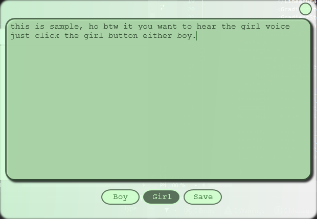

<h1 align="center">Talking Text</h1>

Talking Text is a program that can convert the text string to speak i now it is common but you can also save what you converted text as sound to mp3 file. btw their have two mode the `girl` voice and `boy` voice.  

##### setup: follow the setup :)

-- download the file using this command and also i expected that you have installed the `git bush` in your windows because the programming language I've used is c#. 

-- open any terminal in windows commonly is `cmd`, in `cmd` type `git clone ` in `Talking Text` folder find the  `build.bat` and double click the `build.bat` to build the program in bin folder.

------

